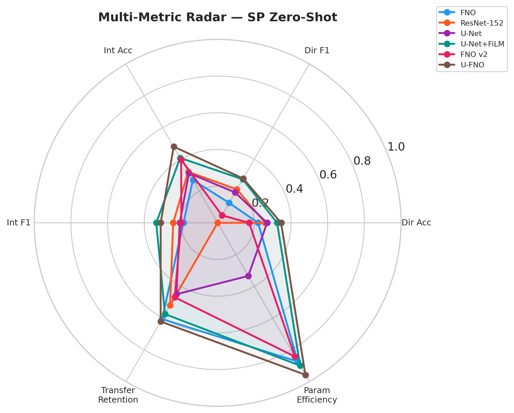
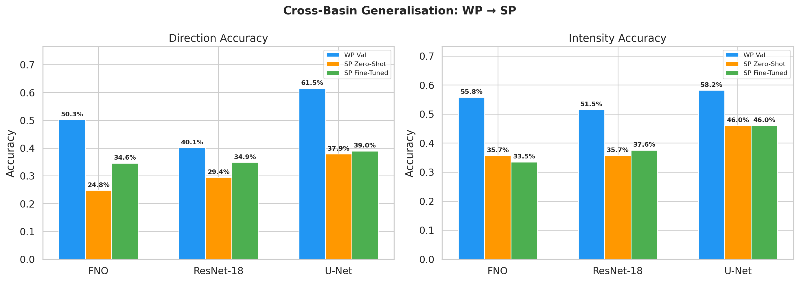
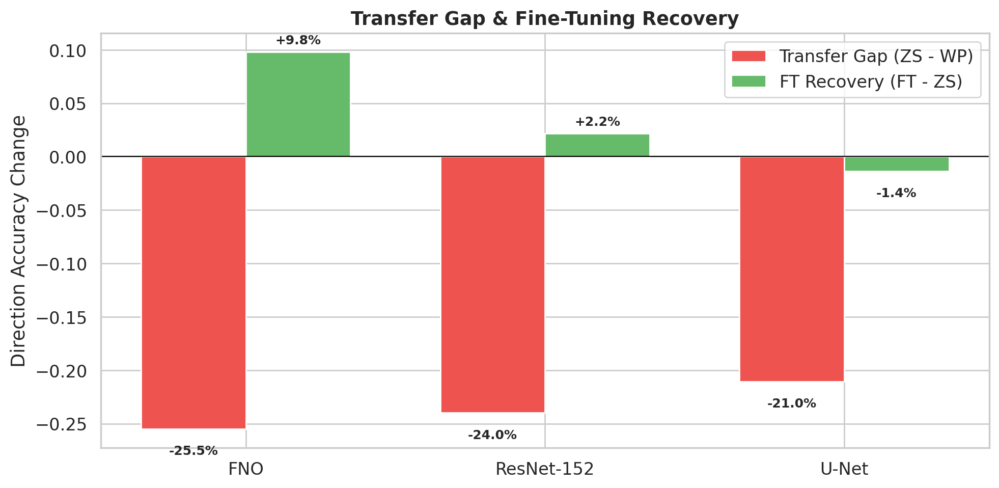
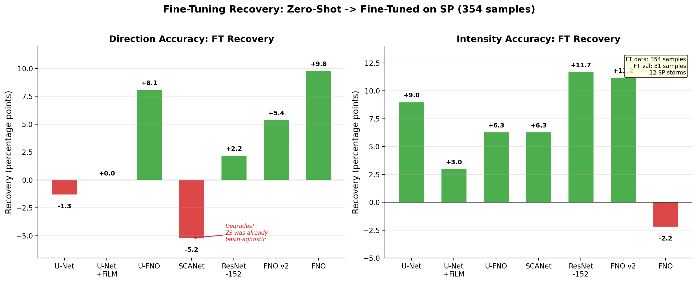

# Cross-Basin Generalisation for Tropical Cyclone Forecasting

**Can models trained on Western Pacific cyclones generalise to the South Pacific?**

Samuel Zhang, Loïc Bouxirot, Yasmin Akhmedova

ELEC70127 — Machine Learning for Tackling Climate Change · Imperial College London · March 2026

---

## Overview

Tropical cyclone forecasting in data-scarce ocean basins is limited by small training sets. The South Pacific (SP) has only 30 storms in the TropiCycloneNet dataset, compared to 117 in the Western Pacific (WP). This project tests whether models trained on WP can transfer to SP — a cross-hemisphere problem where the Coriolis force reverses storm dynamics.

We frame the task as dual classification: **8-class direction** (N, NE, E, SE, S, SW, W, NW) and **4-class intensity change** (weakening, steady, slow intensification, rapid intensification), predicted 24 hours ahead from multimodal inputs (atmospheric grids, environmental features, and track data).

Eight architectures are compared across two model families — spatial (U-Net) and spectral (FNO) — plus two physics-informed designs (PI-GAN, SCANet). Each model is evaluated in three settings: in-basin (WP validation), zero-shot transfer (SP, no fine-tuning), and fine-tuned (SP, 354 training samples).

<p align="center">
  
</p>
<p align="center"><em>Multi-axis comparison of final models across direction accuracy, intensity accuracy, F1 scores, and transfer gap.</em></p>

---

## Key Results

| Model | Params | WP Dir | WP Int | SP Zero-Shot Dir | SP Zero-Shot Int | SP Fine-Tuned Dir | SP Fine-Tuned Int |
|:------|-------:|-------:|-------:|-----------------:|-----------------:|------------------:|------------------:|
| U-Net | 39.1M | 63.3% | 58.1% | 31.1% | 41.1% | 34.9% | 46.9% |
| U-Net + FiLM | 5.9M | 59.2% | 60.3% | 33.5% | 49.3% | 40.9% | 46.6% |
| FNO | 7.4M | 57.9% | 64.1% | 33.0% | 48.5% | 35.4% | 52.0% |
| FNO v2 + FiLM | 9.3M | 59.7% | 59.0% | 36.8% | 48.5% | 32.7% | 54.2% |
| U-FNO | 2.5M | 61.0% | 58.5% | 37.9% | 52.3% | 31.6% | 49.0% |
| PI-GAN | — | — | — | — | — | — | — |
| SCANet | 3.7M | 56.4% | 66.2% | **43.3%** | 36.8% | 38.1% | 43.1% |

*Accuracy (%). Bold = best in column. PI-GAN results in supplementary notebooks.*

**Main findings:**

- No single architecture wins both tasks. Spatial models (U-Net) read local wind patterns for direction; spectral models (FNO/U-FNO) read basin-wide thermodynamics for intensity.
- Intensity transfers better than direction across all models. The underlying physics (SST, wind shear) is shared between hemispheres; storm movement patterns are not.
- SCANet achieves the best zero-shot direction transfer (43.3%), with the smallest transfer gap of -13.1pp. Its cross-attention mechanism learns more basin-invariant features than FiLM's uniform modulation.
- Fine-tuning on 354 SP samples recovers intensity well (+3–6pp) but barely improves direction, which remains fundamentally hemisphere-dependent.

<p align="center">
  
</p>
<p align="center"><em>Direction and intensity accuracy across in-basin, zero-shot, and fine-tuned settings for all models.</em></p>

<p align="center">
  
</p>
<p align="center"><em>Transfer gap (drop from WP validation to SP zero-shot). Smaller bars = better generalisation.</em></p>

---

## Models

Two architecture families, each starting from a baseline and building up:

**Spatial family** — local convolutions, hypothesised to be better for direction:

| ID | Model | Params | Description |
|:---|:------|-------:|:------------|
| 1a | U-Net | 39.1M | 4-level encoder-decoder, SE attention, residual blocks, DropPath |
| 1b | U-Net + FiLM | 5.9M | Adds temporal conditioning via Feature-wise Linear Modulation |

**Spectral family** — frequency-domain learning, hypothesised to be better for intensity:

| ID | Model | Params | Description |
|:---|:------|-------:|:------------|
| 2a | FNO | 7.4M | Fourier Neural Operator baseline, 4 spectral layers |
| 2b | FNO v2 + FiLM | 9.3M | Reflect padding to fix boundary artifacts, FiLM conditioning |
| 2c | U-FNO | 2.5M | 3-branch gated hybrid — spectral + U-Net + residual paths with learned softmax gates |

**Physics-informed architectures:**

| ID | Model | Params | Description |
|:---|:------|-------:|:------------|
| — | PI-GAN | ~10M | WGAN-GP with physics reconstruction head (vorticity, divergence, shear) |
| — | SCANet | 3.7M | Spectral cross-attention with early multimodal fusion and physics auxiliary loss |

ResNet-152 (58.7M params) is included as a standard CNN baseline.

---

## Repository Structure

```
├── main-analysis.ipynb                              ← Start here: full report with results
├── requirements.txt                                 ← Python dependencies
├── CONTEX.pdf                                       ← Project brief and slide deck notes
│
├── data/                                            ← gitignored — see "Data" section below
│   ├── DATA_GUIDE.md                                ← Data documentation
│   └── processed-data/                              ← Model-ready tensors (~1.4 GB)
│       ├── grids/                                       15-channel 81×81 atmospheric fields
│       ├── env/                                         40-dim environmental features
│       ├── data1d/                                      4-dim track features
│       ├── labels/                                      Direction (8-class) + intensity (4-class)
│       └── time/                                        6-dim temporal features
│
├── checkpoints/                                     ← Model weights (.pt, gitignored — generated by training)
├── figures/                                         ← 78 generated visualisations
├── logs/                                            ← Training logs and results JSON
│
├── supplementary-notebooks/
│   ├── preprocessing/
│   │   ├── data-preprocessing-pipeline.ipynb            Raw TCND → processed tensors
│   │   └── temporal-feature-extraction.py               Cyclical time features
│   ├── models/
│   │   ├── model-1a-unet.ipynb                          U-Net baseline
│   │   ├── model-1b-unet-film.ipynb                     U-Net + FiLM
│   │   ├── model-2a-fno.ipynb                           FNO baseline
│   │   ├── model-2b-fno-film.ipynb                      FNO v2 + FiLM
│   │   ├── model-2c-ufno.ipynb                          U-FNO hybrid
│   │   ├── pi-gan.ipynb                                 Physics-Informed GAN
│   │   ├── scanet.ipynb                                 SCANet
│   │   └── *.py                                         Matching run scripts (CLI)
│   └── supplementary-analysis/
│       ├── ablation-and-shap-comparison.ipynb            Feature ablation + SHAP
│       └── model-comparison.ipynb                        Cross-model comparison
│
└── archive/                                         ← Earlier experiments and drafts
```

---

## Getting Started

### 1. Install dependencies

```bash
pip install -r requirements.txt
```

Requires Python 3.10+ and PyTorch 2.0+. A CUDA GPU speeds up training but is not required — all notebooks fall back to CPU.

### 2. Data

The `data/` directory is **gitignored** due to size. Download and prepare it before running any notebooks:

```bash
# Download raw TropiCycloneNet dataset (~3.34 GB zip)
wget https://zenodo.org/api/records/15009527/files-archive -O tcnd.zip
unzip tcnd.zip -d data/tropicyclonenet/
```

Then run the preprocessing pipeline to generate model-ready tensors in `data/processed-data/`:

1. `supplementary-notebooks/preprocessing/data-preprocessing-pipeline.ipynb` — builds processed tensors (~1.4 GB across 5 splits)
2. `supplementary-notebooks/preprocessing/temporal-feature-extraction.py` — adds temporal features

See [`data/DATA_GUIDE.md`](data/DATA_GUIDE.md) for full documentation on data formats, splits, and what each tensor contains.

### 3. Run the analysis

Open **`main-analysis.ipynb`** — this is the full report covering data exploration, model architectures, results, and interpretation.

To retrain models or run supplementary analysis:

```bash
# Train a specific model (e.g., U-FNO)
cd supplementary-notebooks/models
python model-2c-ufno-run.py          # CLI
# or open model-2c-ufno.ipynb        # notebook

# Run ablation / SHAP analysis
cd supplementary-notebooks/supplementary-analysis
jupyter notebook ablation-and-shap-comparison.ipynb
```

All model notebooks can be run independently and in parallel. Each saves checkpoints to `checkpoints/` and figures to `figures/`.

### 4. Checkpoints

Checkpoint files (`.pt`) are **not included in the repo** — they are gitignored due to size. To generate them, run the model training notebooks or scripts listed above. Each model produces two checkpoints: `{model}_best_wp.pt` (WP-trained) and `{model}_best_ft.pt` (SP-fine-tuned), saved to `checkpoints/`.

---

## Transfer Protocol

The experiment follows a two-stage transfer pipeline:

1. **Zero-shot transfer** — Train on WP data (3,252 samples, 105 storms). Apply hemisphere-aware corrections (direction label reflection, meridional wind sign flip) and evaluate directly on SP test data. No SP data is seen during training. This measures how much knowledge transfers from shared physics alone.

2. **Fine-tuning** — Take the WP-pretrained model, fine-tune on a small SP training set (354 samples, 12 storms) with a reduced learning rate. Evaluate on SP test data (367 samples, 15 storms). This measures how much target-basin data is needed to close the transfer gap.

<p align="center">
  
</p>
<p align="center"><em>Fine-tuning recovery: change in accuracy from zero-shot to fine-tuned for each model.</em></p>

---

## References

1. Huang, C., Mu, P., Zhang, J., et al. (2025). "Benchmark dataset and deep learning method for global tropical cyclone forecasting." *Nature Communications*.
2. Li, Z., et al. (2021). "Fourier Neural Operator for Parametric Partial Differential Equations." *ICLR*.
3. Perez, E., et al. (2018). "FiLM: Visual Reasoning with a General Conditioning Layer." *AAAI*.
4. Wen, G., et al. (2022). "U-FNO — An enhanced Fourier neural operator." *Advances in Water Resources*.
5. TropiCycloneNet Dataset — [Zenodo Record 15009527](https://zenodo.org/records/15009527)
